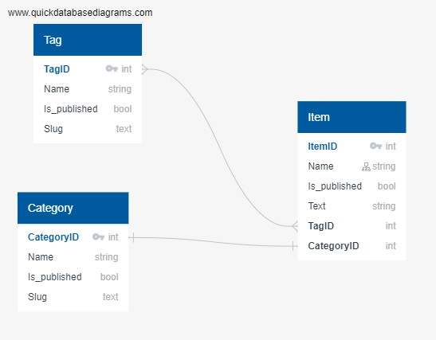

## PIPELINE
# Чтобы на сайте проекта было красиво


## VENV 
# Создаём и активируем
```bash
python -m venv venv
venv/bin/activate
source venv/bin/activate
```
## REQUIREMENTS
# FOR DEPLOING
```bash
pip install -r requirements/prod.txt
```
# FOR DEVELOPMENT
```bash
pip install -r requirements/dev.txt
```

# FOR TESTING
```bash
pip install -r requirements/test.txt
```

## VENV VARIABLES
Скопируйте файл "config.env"  в ".env", если нужно, отредактируйте значения переменных
```bash
cp config.env .env
```

## DATABASE
Структура базы данных отображена в файле ER.jpg в корне проекта


## LAUNCH
Нужно применить миграции, чтобы база данных работала
Чтобы получить доступ к админке, нужно создать пользователя с соответствующим доступом
```bash
python lyceum/manage.py migrate
python lyceum/manage.py createsuperuser
```